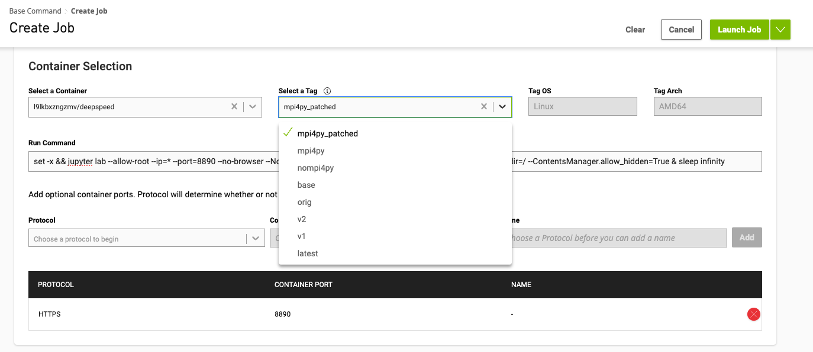

# Fine-Tuning set-up


Instructions on how to FT mistral, codellama and other Hagginsface opensource models:

1. Clone SAP repo with FT solution [llm-fine-tuning-lab](https://github.tools.sap/DL-COE/llm-fine-tuning-lab) (in needed): 
   ```bash
   $ mkdir ft-training-external-gits
   $ cd ft-training-external-gits
   ft-training-external-gits$ git submodule add https://github.tools.sap/DL-COE/llm-fine-tuning-lab
   ```

Next step is to modify copy/paste relevant files to the proper locations:
```js
ft-training-external-gits/
├── llm-fine-tuning-lab/ 
├── README.md   
├── train_text2signal.py           -> llm-fine-tuning-lab/fine_tuning_scripts/train_text2signal.py
├── generate_predictions_signal.py        -> llm-fine-tuning-lab/fine_tuning/evaluation/generate_predictions_signal.py
├── text2signal_config_signal.yaml -> llm-fine-tuning-lab/fine_tuning/config/text2signal_config_signal.yaml
└── text2signal_tuning_data.yaml   -> llm-fine-tuning-lab/fine_tuning/config/data/text2signal_tuning_data.yaml
```

### Training - FT Hugging Face LLMs: mistralai/Mistral-7B-Instruct-v0.1 codellama/CodeLlama-7b-Instruct-hf

We assume that respective docker image is on DGX cloud and this dir is mounted to the DGX systems external workspace.


[NGC/DGX CLI documentation](https://docs.ngc.nvidia.com/cli/cmd_workspace.html)

#### Create dataset/workspaces

```bash
$  ngc dataset upload --desc "text2signal train/test JSON/JSONL" --source t2s_data t2s_data
$ 
text2SIGNAL$ ngc workspace create --name signavio-ft-training  # Create NEW workspace
text2SIGNAL$ ngc workspace upload --source  ft-training-external-gits signavio-ft-training # Upload local files/dir to the above workspace
$
```

#### Create FT JOB on DGX system:

[Link to DGC cloud](https://bc.ngc.nvidia.com/jobs)

DGC command to start Jupyter on port 8890 inside container: `l9lkbxzngzmv/deepspeed:mpi4py_patched`

##### From UI:



##### From CLI:

```js
$ ngc base-command job run --name "Job-sap-scus-ace-223398" --priority NORMAL --preempt RUNONCE --min-timeslice 7776000s --total-runtime 7776000s --ace sap-scus-ace --instance dgxa100.80g.1.norm --commandline "set -x && jupyter lab --allow-root --ip=* --port=8890 --no-browser --NotebookApp.token='' --NotebookApp.allow_origin='*' --notebook-dir=/ --ContentsManager.allow_hidden=True & sleep infinity" --result /results --image "l9lkbxzngzmv/deepspeed:mpi4py_patched" --org l9lkbxzngzmv --datasetid 1618270:/mount/data --workspace mzJTGlJxTtWmWQFFhQZDdQ:/mount/ft-coe-package:RW --port 8890
```

Open a link to Jyper when DGC job started. 
From now we are inside the Jupyter Lab UI.

**llm-fine-tuning-lab/scripts/train_text2signal.py** 
The key file to run FT experiment (assuming that this folder is cloned on GPU node):

#### I. Step Fine-Tuning run 11 Epochs 20h

```bash
cd /mount/ft-coe-package/llm-fine-tuning-lab

$ PYTHONPATH=. python fine_tuning_scripts/train_text2signal.py model.hf_model_id=mistralai/Mistral-7B-Instruct-v0.1
# OR
$ PYTHONPATH=. python fine_tuning_scripts/train_text2signal.py model.hf_model_id=codellama/CodeLlama-7b-Instruct-hf
...
  | Name  | Type                 | Params
-----------------------------------------------
0 | model | PeftModelForCausalLM | 6.8 B 
-----------------------------------------------
33.6 M    Trainable params
6.7 B     Non-trainable params
6.8 B     Total params
27,088.404Total estimated model params size (MB)
# OR
$ PYTHONPATH=. python fine_tuning_scripts/train_text2signal.py model.hf_model_id=chatdb/natural-sql-7b 
...
  | Name  | Type                 | Params
-----------------------------------------------
0 | model | PeftModelForCausalLM | 6.9 B 
-----------------------------------------------
31.5 M    Trainable params
6.9 B     Non-trainable params
6.9 B     Total params
27,767.292Total estimated model params size (MB)
```

#### II. Step merge adapters with original weights to one repo:

```bash
# 11 epoch 1536
PYTHONPATH=. python fine_tuning_scripts/merge_peft_adapters.py --base_model_name_or_path codellama/CodeLlama-7b-Instruct-hf --peft_model_path /results/local_dataset_out_11_epochs_codellama-lr-05/codellama/CodeLlama-7b-Instruct-hf-lora-11-epochs/ckpts/epoch\=10-step\=15540-hf-ckpt/

# 16 Feb
 PYTHONPATH=. python fine_tuning_scripts/merge_peft_adapters.py --base_model_name_or_path codellama/CodeLlama-7b-Instruct-hf --peft_model_path /results/local_dataset_out_11_epochs_codellama-7b-lr-05_01/hf-ckpts/epoch\=4-step\=6966-hf-ckpt/ 
 ...
 saving to /results/local_dataset_out_11_epochs_codellama-7b-lr-05_01/hf-ckpts/epoch=4-step=6966-hf-ckpt-merged
 ...
# 19 Feb
PYTHONPATH=. python fine_tuning_scripts/merge_peft_adapters.py --base_model_name_or_path chatdb/natural-sql-7b --peft_model_path /results/local_dataset_out_11_epochs_chatdb_natural-sql-7b-lr-05

```

#### III. Run inference to generate outputs with FT predictions:

```bash
PYTHONPATH=. python fine_tuning/evaluation/generate_predictions.py  --model_id codellama/CodeLlama-7b-Instruct-hf --model_path /results/local_dataset_out_30_epochs_codellama-lr-05/codellama/CodeLlama-7b-Instruct-hf-lora-30-epochs/ckpts/epoch=29-step=42191-hf-ckpt-merged --gt_path /mount/data/text2signal_test_1000.jsonl --output_path out_code_llame-epochs-30-lr-05.json --llm_name codellama
# 16 feb
PYTHONPATH=. python fine_tuning/evaluation/generate_predictions_signal.py  --model_id codellama/CodeLlama-7b-Instruct-hf --model_path  /results/local_dataset_out_11_epochs_codellama-7b-lr-05_01/hf-ckpts/epoch=4-step=6966-hf-ckpt-merged --gt_path /mount/data/text2signal_test_1000.jsonl --output_path out_code_llame-epochs-11-lr-04_no_mask.json --llm_name codellama
# 19 Feb
PYTHONPATH=. python fine_tuning/evaluation/generate_predictions_signal.py  --model_id chatdb/natural-sql-7b --model_path /results/local_dataset_out_11_epochs_chatdb_natural-sql-7b-lr-04/hf-ckpts/epoch=3-step=5037-hf-ckpt-merged --gt_path /mount/data/text2signal_test_1000.jsonl --output_path out_chatdb_natural-sql-7b-step_5037-lr-04.json --llm_name chatdb

```

#### Copy the trained/merged weights to the AWS S3.

```py
root@5911654:/results/local_dataset_out_11_epochs_chatdb_natural-sql-7b-lr-04/hf-ckpts/epoch=3-step=5037-hf-ckpt-merged# ls -ltrh
total 13G
-rw-r--r-- 1 99 99  111 Feb 19 09:46 generation_config.json
-rw-r--r-- 1 99 99  692 Feb 19 09:46 config.json
-rw-r--r-- 1 99 99 4.7G Feb 19 09:46 model-00001-of-00003.safetensors
-rw-r--r-- 1 99 99 4.7G Feb 19 09:46 model-00002-of-00003.safetensors
-rw-r--r-- 1 99 99  22K Feb 19 09:46 model.safetensors.index.json
-rw-r--r-- 1 99 99 3.6G Feb 19 09:46 model-00003-of-00003.safetensors
```

## Fine-Tuning with Aleph-alpha

Assumptions that docker file and respective image are available:

```bash
docker pull registry.gitlab.aleph-alpha.de/product/finetuning-deployment/aa-finetuning
docker image inspect registry.gitlab.aleph-alpha.de/product/finetuning-deployment/aa-finetuning:latest
docker image inspect bc0ca77efc7c
docker tag bc0ca77efc7c6a24e1cd04181a3c1e998dfb07820d5ad7b2e3d96c7c4e003df4 nvcr.io/l9lkbxzngzmv/aa-ft-01:latest

```

However for DGX set up one need add jupyter lab to the above docker *DokerfileAA.dgxcloud* image:

 ```docker
FROM nvcr.io/l9lkbxzngzmv/aa-ft-01

RUN pip install jupyterlab
```

Next we build it 

```bash
docker build -f DokerfileAA.dgxcloud .
```

re-tag and push to DGX system:

```bash
docker tag 797ea06b07c1 nvcr.io/l9lkbxzngzmv/aa-ft-02:latest
docker  push nvcr.io/l9lkbxzngzmv/aa-ft-02:latest 
```

Run DGX JOB:

```bash
ngc base-command job run --name "Job-sap-scus-ace-637221" --priority NORMAL --preempt RUNONCE --min-timeslice 7776000s --total-runtime 7776000s --ace sap-scus-ace --instance dgxa100.80g.1.norm --commandline "set -x && jupyter lab --allow-root --ip=* --port=8889 --no-browser --NotebookApp.token='' --NotebookApp.allow_origin='*' --notebook-dir=/ --ContentsManager.allow_hidden=True & sleep infinity" --result /results --image "l9lkbxzngzmv/aa-ft-02:latest" --org l9lkbxzngzmv --workspace r0bfCtECTnGTPdOJqZ8dlQ:/mount/ftaa:RW --port 8889
```

Login to the Jupyter lab from above job and run fine-tuning with AA:

```bash
/aleph_alpha_luminous# python run.py /aleph_alpha_luminous/configs/luminous_base_adapter.yml 
```


